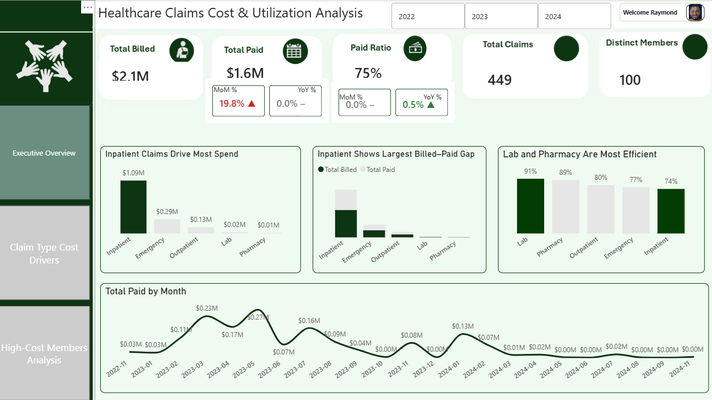
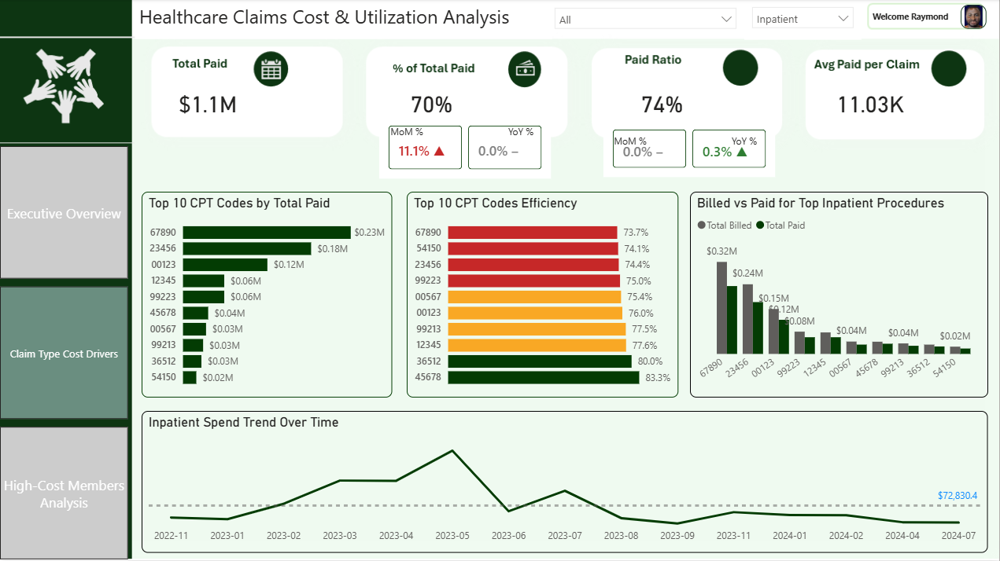
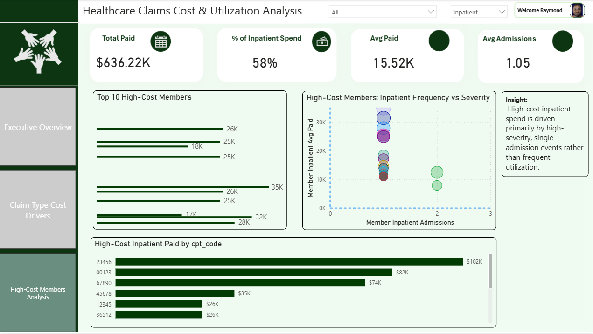

# Healthcare-Claims-Cost-Utilization-Analysis
This project analyzes healthcare claims data to understand where healthcare dollars are being spent, identify key cost drivers, highlight high-cost members, and uncover payment gaps between billed and paid amounts. 

# Healthcare Claims Cost & Utilization Analysis

## 📌 Project Overview
This project analyzes healthcare claims data to understand where healthcare dollars are being spent, identify key cost drivers, highlight high-cost members, and uncover payment gaps between billed and paid amounts. The objective is to generate actionable insights that can support payer cost containment, utilization management, and care management strategies.

The analysis is presented through interactive executive dashboards built in Power BI.

---

## 🎯 Business Objectives
The project answers four core business questions:

1. Which claim types are the most expensive?
2. Which CPT and ICD codes drive the highest healthcare spending?
3. Which members account for the largest share of total costs?
4. How do billed amounts compare to paid amounts across services?

---

## 🗂️ Dataset Description
The dataset is a synthetic healthcare claims dataset containing:

- Member demographics
- Claim types (Inpatient, Outpatient, Emergency, Lab, Pharmacy)
- CPT (procedure) codes
- ICD (diagnosis) codes
- Billed amounts
- Paid amounts
- Service dates

---

## 🛠️ Tools & Technologies
- **SQL** – Data preparation, aggregation, and validation  
- **Power BI** – Data modeling, DAX measures, and dashboard development  
- **DAX** – Time intelligence, ranking, KPI calculations  
- **Excel** – Initial data review and validation  

---

## 🔄 Workflow
1. Imported and cleaned claims and member data  
2. Built a star-schema data model with a dedicated date dimension  
3. Created DAX measures for KPIs, paid ratios, MoM/YoY trends, and rankings  
4. Developed three executive-focused dashboard pages:
   - Executive Overview
   - Claim Type Cost Drivers
   - High-Cost Member Analysis

---

## 🧮 SQL Analysis & Queries
SQL was used to validate data, identify cost drivers, and support business insights prior to visualization in Power BI.

---

### 1️⃣ Claim Type Cost Breakdown
Identifies which services drive the highest cost and payment inefficiency.

```sql
SELECT
    claim_type,
    COUNT(*) AS claim_count,
    SUM(billed_amount) AS total_billed,
    SUM(paid_amount) AS total_paid,
    ROUND(SUM(paid_amount) / SUM(billed_amount), 2) AS paid_ratio
FROM claims
GROUP BY claim_type
ORDER BY total_paid DESC;


2️⃣ CPT Codes Driving the Highest Spend

Identifies high-cost procedures and severity drivers.

SELECT
    cpt_code,
    COUNT(*) AS claim_count,
    SUM(paid_amount) AS total_paid,
    ROUND(AVG(paid_amount), 2) AS avg_paid_per_claim
FROM claims
GROUP BY cpt_code
ORDER BY total_paid DESC
LIMIT 10;

3️⃣ ICD Diagnosis Cost Drivers

Highlights diagnoses associated with the highest costs.

SELECT
    icd_code,
    COUNT(*) AS claim_count,
    SUM(paid_amount) AS total_paid
FROM claims
GROUP BY icd_code
ORDER BY total_paid DESC
LIMIT 10;

4️⃣ High-Cost Members

Identifies members responsible for a disproportionate share of total spend.

SELECT
    member_id,
    COUNT(*) AS claim_count,
    SUM(paid_amount) AS total_paid
FROM claims
GROUP BY member_id
ORDER BY total_paid DESC
LIMIT 10;

5️⃣ Inpatient Cost Concentration

Analyzes inpatient severity vs frequency at the member level.

SELECT
    member_id,
    COUNT(*) AS inpatient_admissions,
    SUM(paid_amount) AS inpatient_paid
FROM claims
WHERE claim_type = 'Inpatient'
GROUP BY member_id
ORDER BY inpatient_paid DESC;

6️⃣ Billed vs Paid Summary

Quantifies overall payment leakage.

SELECT
    SUM(billed_amount) AS total_billed,
    SUM(paid_amount) AS total_paid,
    ROUND(SUM(paid_amount) / SUM(billed_amount), 2) AS overall_paid_ratio
FROM claims;

```

## 📊 Key Findings & Insights

### 1️⃣ Claim Type Cost Drivers
- **Inpatient claims dominate spending**, accounting for **$1.09M of $1.6M total paid (~70%)**
- **Emergency claims** are the second largest driver at **$294K (~19%)**
- Outpatient, Lab, and Pharmacy combined contribute **less than 11%** of total spend

**Insight:** Acute care services represent the primary cost pressure.

---

### 2️⃣ CPT & ICD Cost Drivers
- A small number of CPT codes account for a disproportionate share of spend
- The **Top 5 CPT codes drive ~$741K (~46%)** of total paid costs
- Several high-cost CPTs show lower paid ratios, indicating pricing inefficiencies
- Top ICD codes also show strong cost concentration around a small number of diagnoses

**Insight:** Procedure-level concentration presents clear opportunities for utilization management and contract optimization.

---

### 3️⃣ High-Cost Member Analysis
- The **top 20% of members drive ~58% of inpatient spending**
- Average inpatient cost per high-cost member: **$15.5K**
- Average inpatient admissions per high-cost member: **~1.05**

**Key observation:** High costs are driven primarily by **severity**, not frequent utilization.

---

### 4️⃣ Billed vs Paid Analysis
- **Total billed:** ~$2.1M  
- **Total paid:** ~$1.6M  
- **Overall paid ratio:** ~75%

**Paid Ratio by Claim Type:**
- Lab: ~91% (most efficient)
- Pharmacy: ~89%
- Outpatient: ~80%
- Emergency: ~77%
- Inpatient: ~74% (lowest)

**Insight:** The largest payment gaps occur in Inpatient and Emergency services.

---

## 💡 Business Recommendations
- Prioritize inpatient cost containment initiatives
- Target high-cost CPT codes for prior authorization and pricing review
- Shift care management toward severity-based interventions
- Maintain current Lab and Pharmacy pricing strategies
- Monitor paid ratios monthly as an early warning KPI

---

## 📈 Dashboard Pages
- **Executive Overview:** High-level spend, trends, and efficiency KPIs  
- **Claim Type Cost Drivers:** Procedure-level and service-level drilldowns  
- **High-Cost Member Analysis:** Member cost concentration and severity vs frequency analysis

--- 
## 📊 Dashboard Screenshots

### Executive Overview


This page provides a high-level view of total spend, paid ratios, and time trends to help executives quickly understand overall cost performance.

---

### Claim Type Cost Drivers


This page drills into cost drivers by claim type and procedure, highlighting high-cost CPTs and utilization patterns.

---

### High-Cost Member Analysis


This page identifies cost concentration among members and visualizes inpatient severity versus utilization frequency to support targeted care management decisions.

> Note: Dashboards are interactive in Power BI. Screenshots are provided for reference; slicers allow filtering by year and claim type.


---

## 🚀 Conclusion
This analysis demonstrates how healthcare claims data can be transformed into actionable insights that support strategic decision-making. By focusing on service-level, procedure-level, and member-level cost drivers, healthcare payers can more effectively target interventions that reduce cost while preserving care quality.

---

## 📎 Author
**Ray**  
Data Analytics | Healthcare Analytics | Business Intelligence  

